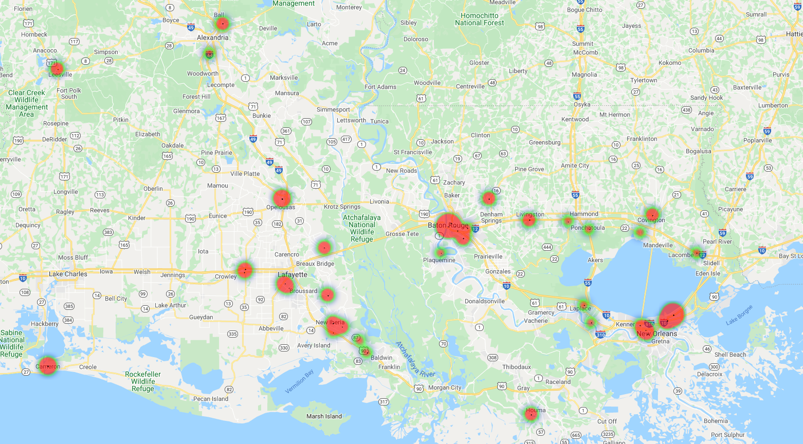
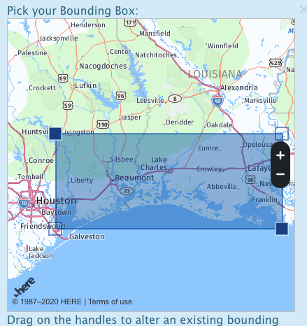
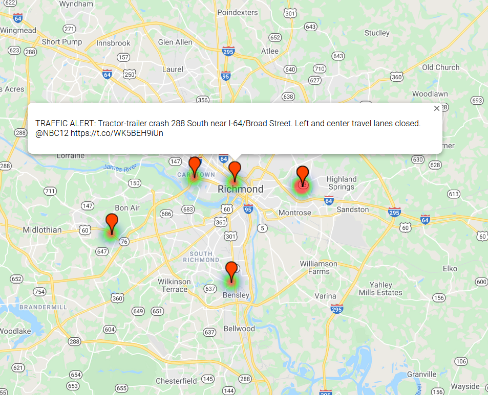

# Optimizing Evacuation Routes - Identifying Road Closures Using Social Media

_Ryan Mackie, Will Arliss, Caleb Stephenson, Josh Mizraji_

**Problem Statement**

Mapping systems have come a long way since the first in-car navigation systems, and most drivers have begun to rely on apps like Waze, Google Maps or Apple Maps.  While these apps generally do well at providing optimal routes between destinations, they often do not rely on real-time data.

With this project we are aiming to leverage social media and other sources, in order to build classification models to determine if a tweet or post references a road closure. By extracting geolocations from these posts we will be able to construct a map and plot these closures as they occur. 

## Executive Summary

**Contents:**

[Twitter Data Collection](https://git.generalassemb.ly/willarliss/project-5/blob/master/01%20Tweet%20Data%20Collection.ipynb)

[LADOT Data Collection](https://git.generalassemb.ly/willarliss/project-5/blob/master/01.1%20LADOT%20Data%20Collection.ipynb)

[HERE API Data Collection](https://git.generalassemb.ly/willarliss/project-5/blob/master/01.2%20Here%20API%20Data%20Collection.ipynb)
 
[Twitter NLP](https://git.generalassemb.ly/willarliss/project-5/blob/master/02%20Tweet%20NLP.ipynb)

[LADOT NLP](https://git.generalassemb.ly/willarliss/project-5/blob/master/02.1%20LADOT%20NLP.ipynb)

[Twitter Modeling](https://git.generalassemb.ly/willarliss/project-5/blob/master/03%20Tweet%20Modeling.ipynb)

[LADOT Modeling](https://git.generalassemb.ly/willarliss/project-5/blob/master/03.1%20LADOT%20Modeling.ipynb)

[HERE Geocoding](https://git.generalassemb.ly/willarliss/project-5/blob/master/04%20GeoCode%20with%20Here%20API.ipynb)

[Mapping the Data](https://git.generalassemb.ly/willarliss/project-5/blob/master/05%20Mapping%20The%20Data.ipynb)

## Notebook Prerequisites:

In order to run our code, you will need to acquire API credentials from both Twitter, HERE.com, and Google. 

**Twitter API:**
- Register for a twitter.com developer account to get API access keys and tokens [Twitter Application](https://apps.twitter.com/) 

**HERE.com API:**
- Register for a HERE.com developer account to get API access keys and tokens [Here](https://developer.here.com/?create=Freemium-Basic&keepState=true&step=account).

**Google Maps - JavaScript API:**
- Register for a google.com developer account to get API access keys and tokens [Google Maps Javascript](https://developers.google.com/maps/documentation/javascript/overview).

**Google Maps - Geocoding API:**
- Register for a google.com developer account to get API access keys and tokens [Google Maps Geocoding](https://developers.google.com/maps/documentation/geocoding/overview).

## Data Acquisition

In order to get around the twitter API limitations, we used [GetOldTweets3](https://pypi.org/project/GetOldTweets3/). This allowed us to scrape posts around the time Hurricane Laura was making landfall. We used certain parameters (selected keywords, locations, and dates) to pinpoint tweets that were likely to be to be related to road closures in the area. Using this process, we were able to gather around 13,000 tweets in reference to Hurricane Laura between August 24th and September 1st.

We also collected around 17,000 posts from the Louisiana Department of Transportation and Development (LADOTD) using a custom function for scraping their website.  

In addition, we pulled 161 traffic updates from the Here API using location boundaries set around the Lake Charles, Louisiana and from the dates between August 20th and September 8th. 

## Twitter Data NLP and Modeling

Using collected tweets, the text data was filtered by using Spacy to perform NLP and identify tweets that were referencing a road or highway. This process used a custom entity ruler to run before Spacy's named entity recognition to identify and label roads, highways, exits, and mile markers. This information was then extracted by tag and added to the database for easy geocoding.

After identifying tweets that were referencing named streets, it was necessary to find which tweets were specifically about roads closing. To achieve this, a model was trained to classify tweets. The training data was prepared by team members who labeled tweets referencing road closures as '1' and those not relevant to road closures as '0'. Gridsearching over various models showed that an AdaBoost Classifier performed well, with high accuracy (~90%) and high precision on testing data. This model, along with the custom natural language processing pipeline, was pickled for use in production code.

**Data**

- training_tweets
    - Csv database containing information pulled from twitter along with labels assigned by team members. This data was used for training the twitter models.
    
- tweets_predictions
    - Csv database with AdaBoost Classifier predictions as to wether the tweets are relevant to road closures. 

**Models**

- tweet_nlp.p
    - Pickled spacy nlp object with custom entity rulers.

- tweets_ada_model.p
    - Pickled AdaBoostClassifer model trained on twitter data to identify road closures.

## LADOT Data NLP and Modeling

One of the resources used to scrape updates on road closures was the Louisiana Department of Transportation and Development (LA DOT). LA DoT contains over 17,000 historical records of road closure updates, dating back to 2013. For this project, updates were only scraped from the last 3 months or so to be used for prediction. For training and testing our models/APIs, updates were scraped going back 3-4 months. 

The Named Entity Recognition (NER) model was borrowed from the Stanford Natural Language Processing Group's `NERLabeler`. The model takes in a phrase, sentence, or paragraph, and returns a sequence of labeled text elements. The model used returns labels for organization, person, location, or other. Because NER is such a difficult and developing field of research, Stanford's publically available model didn't work very well on the LA DoT (which were also not ideal phrases to use). 

Next, a model was built to classify updates as "road closed", "road open", or unknown. Classes were manually labeled for the training set of data. Building such a classifier allowed us to identify LA DoT road closure updates to streamline the updates.

## HERE Geocoding

Before we could plot our identified road closures on a map, we had to find a way to convert the extracted text to `Latitude` and `Longitude` points. To accomplish these, we used the [Here Geocoding and Search API](https://developer.here.com/documentation/geocoding-search-api/dev_guide/topics-api/code-geocode-hybrid.html).

Using location identifiers such as exits, street names, highways, cities, and other location markers, we used the API to geocode the `Latitude` and `Longitude` of a post. One beneficial thing about the Here API is that it returns back a `query_score` and a `field_score`. 

If the input query contains any additional information – name of the person, phone number or a hint to ring twice – the `queryScore` will be low, but the result may be correct. But low queryScore may indicate that the result does not match some relevant part of the address in the input query. 
`fieldScore` – values from `0` to `1` indicating how good the result field matches to the corresponding part of the query. If all the fields that are important for addressing in the country are matched with high quality, one can assume, that queryScore is low because of the additional non-address information. **And the result is still confident.** [Source](https://developer.here.com/documentation/geocoding-search-api/dev_guide/topics-api/code-geocode-scoring.html)

When assessing the tweets with road closures from 8/27/20-8/29/20, we received an average query score of 68%. In addition, when assessing the LADOT Feed road closures from 8/27/20-8/29/20, we received an average query score of 23%, mainly due to the low volume of posts and included more text that did not match a relevant part of the address.

## Mapping Process
After geocoding our data, we used two different approaches to plot our map:

**Google Maps**

Using the [Create A New Map](https://www.google.com/mymaps) feature, we uploaded Here API Feed, Twitter Feed, and LADOT Feed road closure data. The user-friendly interface made it easy to style the map in a visually appealing way. It also enables user interaction, such as viewing additional road closure details and inputting directions. Our map can be viewed below.

         
**Gmplot**

[Gmplot](https://github.com/gmplot/gmplot) is an open-source project that allows a user to render all the data they'd like on top of Google Maps. We used this program in our production ready script because it was fast and easy to automate the creation of a map based on a series of `Latitude` and `Longitude` points that we fed the program. We also saw the heatmap feature as being valuable in the scenario that users want to quickly visualize the most impacted roads during a natural disaster.  

## Visualizations

1. HERE Location

2. Production Code Map

## Run `demonstration.py`

To run the final product of our project pipeline, we included a file called `demonstration.py`. To use the pipeline, run the file in a text editor or command prompt. The user will be prompted to enter a city and state. It is important that the user input is written as: *full city name, full state name*. After the user inputs their location, tweets from that area are pulled. Those tweets are turned into locations. Those locations are then determined to be road closures or not. Once all road closures are found, an interactive map of the general area around the user input. The map will mark all road closures that were found. On completion of the pipeline, a new file will appear in the directory called `map.html`. This will be an interactive map that the user can look at for updates on road closures.

## Conclusion & Recommendations

We were able to build a successful model that classifies road closures for tweets, takes their geolocations and successfully maps them using a Google Maps object to display road closures in real-time.  

Our mapping tool allows a user to input a location (city, state) and receive an interactive Google Map with road closures along with each referenced tweet.  We hope that this lays the groundwork for allowing us to continue with development and eventually produce a tool that will also map the most efficient route as well.   

## Sources
**Documentation**

[Twitter Developer](https://developer.twitter.com/en/docs.html)

[GetOldTweets3](https://pypi.org/project/GetOldTweets3/)

[HERE Developer](https://developer.here.com/documentation)

[LADOT](http://wwwapps.dotd.la.gov/administration/announcements/home.aspx?type=roadandlaneclosure)

[SpaCy](https://spacy.io/)

[Standford NLP Group](https://nlp.stanford.edu/software/CRF-NER.html)

[Gmplot](https://github.com/gmplot/gmplot)

## Project Team:

#### [Ryan Mackie](https://www.linkedin.com/in/ryan-mackie/)
#### [Will Arliss](https://www.linkedin.com/in/william-arliss/)
#### [Caleb Stephenson](https://www.linkedin.com/in/calebstephensontx/)
#### [Josh Mizraji](https://www.linkedin.com/in/joshuamizraji/)

